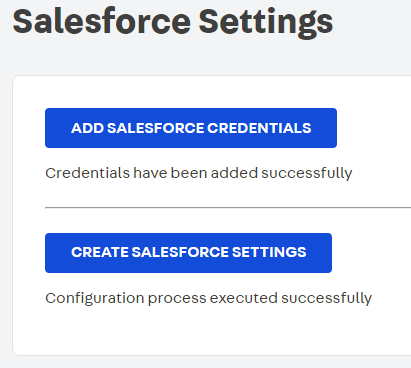

# Salesforce Connector

## Objective

The purpose of this document is to detail the implementation of the middleware responsible of connect VTEX with the Salesforce services. You can:

- Create or update client in Salesforce from VTEX
- Create order in Salesforce from VTEX
- Create products in Salesforce from VTEX
- Manage order states
- Create opportunity in Salesforce for abandoned cart

## Recipes

### Defining routes on _service.json_ 
```json
{
  "memory": 256,
  "ttl": 10,
  "timeout": 2,
  "minReplicas": 2,
  "maxReplicas": 4,
  "workers": 1,
  "routes": {
    "UpdateClientHook": {
      "path": "/v1/vtex/clients",
      "public": true
    },
    "AbandonedCartHook": {
      "path": "/v1/vtex/abandoned-cart",
      "public": true
    },
    "AddCredentialsHook": {
      "path": "/v1/vtex/add-credentials",
      "public": true
    },
    "ConfigurationHook": {
      "path": "/v1/vtex/configuration",
      "public": true
    },
    "GetParametersHook": {
      "path": "/v1/vtex/get-parameters",
      "public": true
    },
    "GetConfigurationHook": {
      "path": "/v1/vtex/get-configuration",
      "public": true
    }
  },
  "events": {
    "orderState": {
      "sender": "vtex.orders-broadcast",
      "topics": [
        "payment-approved",
        "canceled",
        "ready-for-handling",
        "handling",
        "invoiced"
      ]
    }
  }
}
```

The `service.json` file that sits on the root of the `node` folder holds informations about this services.

For cach _key_ on the `routes` object, there should be a **corresponding entry** on the exported Service object on `node/index.ts`, this will hook your code to a specific route.

### Access Control
You can also provide a `public` option for each route. If `true`, that resource will be reachable for everyone on the internet. If `false`, VTEX credentials will be requested as well.

#### HTTP methods
When you define a route on the `service.json`, your NodeJS handlers for that route will be triggered  **on every HTTP method** (GET, POST, PUT...), so, if you need to handle them separately you need to implement a "sub-router". Fortunately, the _node-vtex-api_ provides a helper function `method`, exported from `@vtex/api`, to accomplish that behaviour. Instead of passing your handlers directly to the corresponding route on `index.ts`, you pass a `method` call passing **an object with the desired method as key and one handler as its corresponding value**. Check this example:
```typescript
import type {
  ClientsConfig,
  ServiceContext,
  RecorderState,
  EventContext,
  IOContext,
} from '@vtex/api'
import { method, LRUCache, Service } from '@vtex/api'
import * as dotenv from 'dotenv'

import { Clients } from './clients'
import { orderState } from './middlewares/orderState'
import { updateClientHook } from './middlewares/UpdateClientHook'
import { abandonedCartHook } from './middlewares/AbandonedCartHook'
import { configurationHook } from './middlewares/configurationHook'
import { addCredentialsHook } from './middlewares/addCredentialsHook'
import { getParametersHook } from './middlewares/getParametersHook'
import { getConfigurationHook } from './middlewares/getConfigurationHook'

dotenv.config()

const TIMEOUT_MS = 800

const memoryCache = new LRUCache<string, any>({ max: 5000 })

metrics.trackCache('status', memoryCache)

const clients: ClientsConfig<Clients> = {
  implementation: Clients,
  options: {
    default: {
      retries: 2,
      timeout: TIMEOUT_MS,
    },
    status: {
      memoryCache,
    },
  },
}

declare global {
  type Context = ServiceContext<Clients, State>

  interface StatusChangeContext extends EventContext<Clients> {
    vtex: IOContext
    body: {
      domain: string
      orderId: string
      currentState: string
      lastState: string
      currentChangeDate: string
      lastChangeDate: string
    }
  }

  interface State extends RecorderState {
    code: number
  }
}

export default new Service({
  clients,
  events: {
    orderState,
  },
  routes: {
    UpdateClientHook: method({
      POST: [updateClientHook],
    }),
    AbandonedCartHook: method({
      POST: [abandonedCartHook],
    }),
    AddCredentialsHook: method({
      POST: [addCredentialsHook],
    }),
    ConfigurationHook: method({
      POST: [configurationHook],
    }),
    GetParametersHook: method({
      GET: [getParametersHook],
    }),
    GetConfigurationHook: method({
      GET: [getConfigurationHook],
    }),
  },
})
```

### Reading a JSON body

When writing POST or PUT handlers, for example, often you need to have access to the **request body** that comes as a JSON format, which is not provided directly by the handler function.

For this, you have to use the [co-body](https://www.npmjs.com/package/co-body) package that will parse the request into a readable JSON object, used as below: 
```typescript
import { json } from 'co-body'
export async function method(ctx: Context, next: () => Promise<any>) {
    const body = await json(ctx.req)
```

## Testing

`@vtex/test-tools` and `@types/jest` should be installed on `./node` package as `devDependencies`.

Run `vtex test` and [Jest](https://jestjs.io/) will do its thing.

Check the `node/__tests__/

## Configure

### App Setup

To configure the Salesforce connector you must do the following:



1. Salesforce credentials must be added

2. Salesforce configurations must be created
